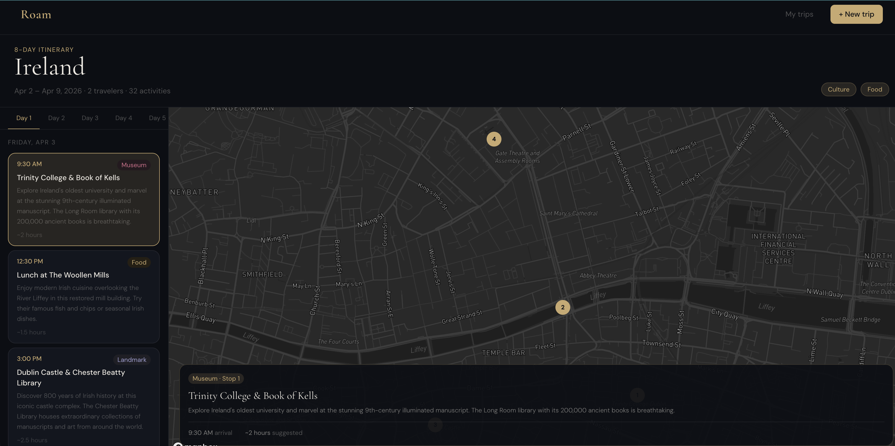

# Roam

[](https://roam-zeta.vercel.app)

Roam is a full-stack travel itinerary planner that uses AI to generate personalized day-by-day trip plans. Built as a portfolio project/side project. [See the live site here](https://roam-zeta.vercel.app)

## Features

- **AI itinerary generation** — describe your destination, dates, travel vibe, and number of travelers and get a full day-by-day itinerary generated in seconds
- **Interactive map view** — each day's activities are pinned on a Mapbox map with a route line and detail panel
- **Trip storage** — trips are saved to localStorage and accessible from the My Trips page
- **Password protection** — a lightweight cookie-based auth gate protects the Anthropic API endpoint from abuse
- **Responsive design** — works across desktop and mobile

---

## Tech stack

- **Framework** — Next.js 15 (App Router)
- **Language** — TypeScript
- **Styling** — Tailwind CSS v4
- **Components** — shadcn/ui
- **Animations** — Framer Motion
- **Map** — Mapbox GL via react-map-gl
- **AI** — Anthropic API (claude-opus-4-5)
- **Fonts** — Cormorant Garamond, DM Sans
- **Deployment** — Vercel

---

## Getting started

### Prerequisites

- Node.js 18+
- An [Anthropic API key](https://console.anthropic.com)
- A [Mapbox access token](https://account.mapbox.com)

### Installation

```bash
git clone https://github.com/yourusername/roam.git
cd roam
npm install
```

### Environment variables

Create a `.env.local` file in the root of the project:

```
ANTHROPIC_API_KEY=your_anthropic_key
NEXT_PUBLIC_MAPBOX_TOKEN=your_mapbox_token
SITE_PASSWORD=your_chosen_password
```

### Run locally

```bash
npm run dev
```

Open [http://localhost:3000](http://localhost:3000) and enter your site password to get started.

---

## Project structure

```
src/
├── app/
│   ├── api/
│   │   ├── auth/
│   │   │   ├── route.ts          # Password authentication
│   │   │   └── check/route.ts    # Auth status check
│   │   └── generate/
│   │       └── route.ts          # Anthropic API call
│   ├── new/
│   │   └── page.tsx              # Trip creation form
│   ├── trip/
│   │   └── [id]/
│   │       └── page.tsx          # Itinerary detail page
│   ├── trips/
│   │   └── page.tsx              # My trips page
│   ├── layout.tsx
│   ├── page.tsx                  # Homepage
│   └── globals.css
├── components/
│   ├── ui/                       # shadcn components
│   ├── ActivityCard.tsx
│   ├── FadeIn.tsx
│   ├── GeneratingScreen.tsx
│   ├── ItineraryView.tsx
│   ├── MapView.tsx
│   ├── Navbar.tsx
│   ├── PasswordGate.tsx
│   └── TripCard.tsx
├── lib/
│   ├── generateItinerary.ts      # API helper
│   ├── seedData.ts               # Demo trip data
│   ├── tripStorage.ts            # localStorage helpers
│   └── utils.ts
└── types/
    └── index.ts                  # Shared TypeScript types
```

---

---
